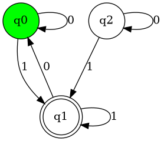
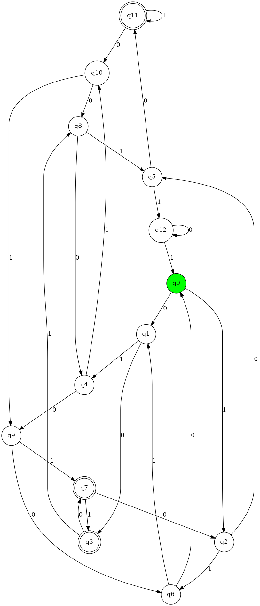

# AutomataSim

  

This repository contains an application called AutomataSim built for the final group project of Cpts 322 (Software Engineering Principles) at Washington State University. 

AutomataSim is a graphical application for visualizing and simulating [deterministic finite automata](https://en.wikipedia.org/wiki/Deterministic_finite_automaton). It introduces a custom domain specific language for defining DFAs in a JSON-like format. Interpreted DFAs can then be simulated on input strings that adhere to the automaton's alphabet.

# Automata DSL

### Syntax
The general syntax of the domain specific language for finite automata is as follows:

    automaton <name> {

        states = {<s>, <s>, ..., <s>};
    
        alphabet = {<a>, <a>, ..., <a>};
    
        transition_func = {
            (<s>, <a>): <s>,
            ...
            (<s>, <a>): <s>
            };

        start_state = <s>;

        accept_states = {<s>, <s>, ..., <s>};
    }

The syntax of inputted automata will be checked to ensure that the fields entered are valid finite automata.

### Example

This automata description,

    automaton finite_automata {
        states = {q0, q1, q2, q3, q4, q5, q6, q7, q8, q9, q10, q11, q12};
        alphabet = {0, 1};
        transition_func = {
            (q0, 0): q1,  (q0, 1): q2,
            (q1, 0): q3,  (q1, 1): q4,
            (q2, 0): q5,  (q2, 1): q6,
            (q3, 0): q7,  (q3, 1): q8,
            (q4, 0): q9,  (q4, 1): q10,
            (q5, 0): q11, (q5, 1): q12,
            (q6, 0): q0,  (q6, 1): q1,
            (q7, 0): q2,  (q7, 1): q3,
            (q8, 0): q4,  (q8, 1): q5,
            (q9, 0): q6,  (q9, 1): q7,
            (q10, 0): q8, (q10, 1): q9,
            (q11, 0): q10,(q11, 1): q11,
            (q12, 0): q12,(q12, 1): q0
        };
        start_state = q0;
        accept_states = {q3, q7, q11};
    }

will be visualized as:

# How to run

From the root directory, run on a linux terminal:

    ./run.sh
